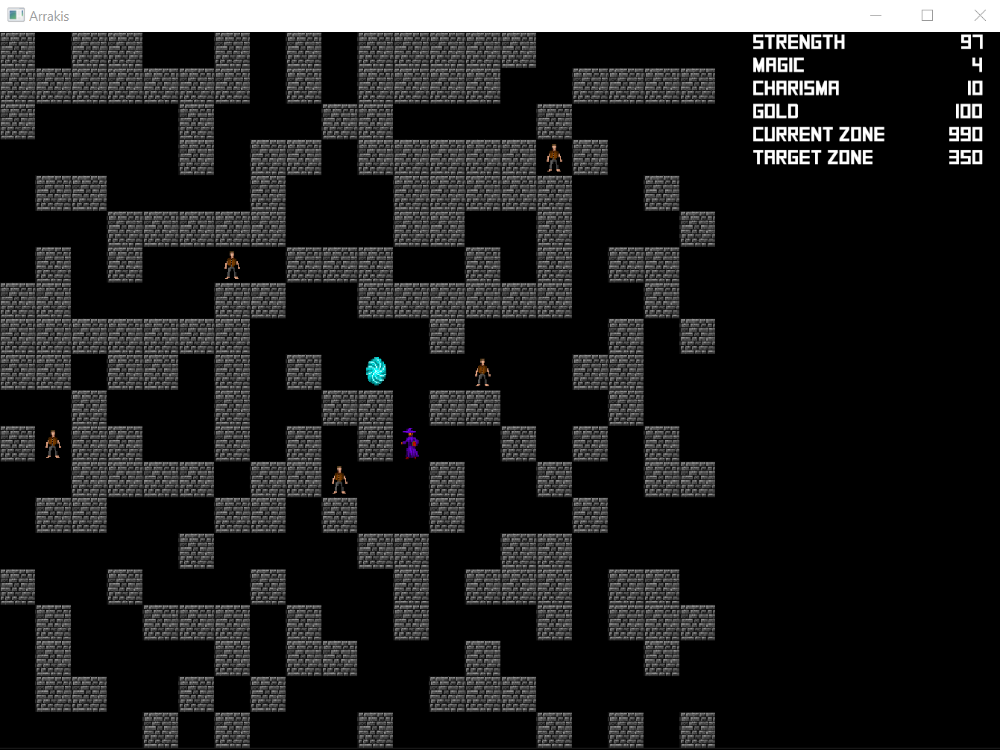

# arrakis

## The Game

Arrakis is a mini role-playing/adventure game. The goal? Walk through the streets of Arrakis to find the fabled Wizard of Arrakis, that can teach you arcane powers you've only dreamt of!

However, Arrakis is a hot place and every move cost you strength. Don't die! Look out for fountains to get back your strength, and you can also avail of armourers and magicians in the streets, that can help you. Find some gold to buy powers from them, and have enough gold to pay the Wizard of Arrakis for his teachings!

## Origins

Arrakis was first published in the 80s as a free Basic program in French game magazine "Jeux et Stratégie". In my family we've kept all these magazines, and I thought it would be fun to port back an ancient small game in more recent technologies, and work with a set of constraints. The original was 100 lines of dense Basic code...

The game was published in Basic. I tried to keep the mechanics as similar as they were described, but some little details may have changed.

I have no idea why it's called Arrakis and if there was supposed to be a connection to Dune at all.

## Mechanics

The game terrain is infinite, as each zone of 20x20 cells is generated automatically from its zone number. Cells can be walls (inpassable) or open terrain (streets). You can move in the four directions but not in diagonal. Moving out of a zone automatically moves you to the next zone (look out for the zone numbers to understand where you have to go). There are inhabitants in each zone that move in diagonal and may block you (you cannot move to a cell occupied by an inhabitant). 

Some cells in a zone are special: some will increase your gold, some will have merchants (armourers and magicians) that will take some gold and increase your strength, charisma and/or magic points. Figure out how to find out these zones!
You have to go to zone 350 in the middle cell with at least 400 gold.
You move by using arrow keys. Then other keys do special actions:
- 'C' uses some of your charisma but makes the inhabitant static for your next movement (they won't follow you during one round)
- 'M' uses some magic that puts down a shield that is inpassable for inhabitants, but not for you. Changing zone wipes out the shields. Shields may modify the special cells and may be used to create fountains or armourers or magicians.
- 'P' uses a lot of stat points but clears out some walls, use if blocked!
- 'R' restarts the game from scratch
- 'F1' shows some help

## Programming

The game is programmed in Rust using the Amethyst framework. This is my first big project both in [Rust](https://www.rust-lang.org/) and [Amethyst](https://github.com/amethyst/amethystAmethyst) and the first time I use an ECS framwework, so the code is probably awful in places, I would enjoy feedback. I have also no certainty that the graphics look good on every resolution, etc. They look OK on my monitor, that's all I can say. Tips on making rendering more robust will be welcomed!

`config.ron` contains a few configuration entries so you can tweak the game without touching the code.

There is no sound yet, I may add later.

Each cell in a zone is an entity, maybe that's horrible design, I'll check out [amethyst-tiles](https://github.com/amethyst/amethyst/tree/master/amethyst_tiles).

Icons I got from https://opengameart.org/content/dungeon-crawl-32x32-tiles, I believe they are free of rights. Sounds from https://opengameart.org/content/rpg-sound-pack. Thanks for sharing!